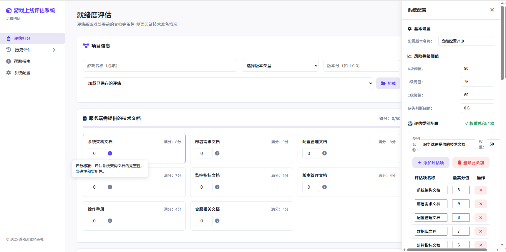
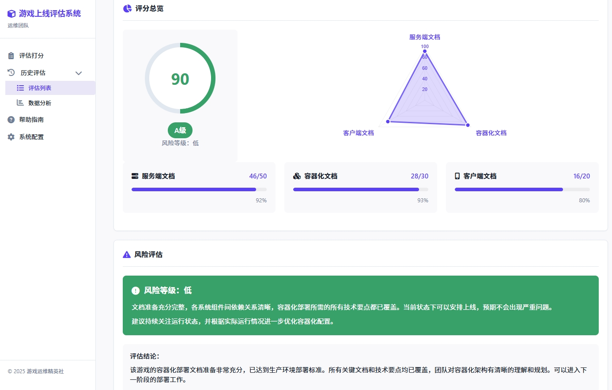

# 游戏上线评估系统
> 专为游戏团队设计的工具，用于评估游戏项目所需的技术准备工作完成度。本系统帮助研发与运维团队在项目容器化过程中统一标准，识别风险点，提前规避潜在问题。
> 评估新游戏部署前的文档完备性-侧面印证技术准备情况。
- 注意：本系统的评估结果仅作为容器化部署决策的参考依据之一，最终决策应结合实际情况，由项目管理层和技术负责人共同制定。




## 一、系统架构

基于Web的前端应用，采用纯HTML、CSS和JavaScript实现，无需后端服务器支持，所有数据存储在浏览器的本地存储中。
提供评估打分、历史数据分析和帮助指南等功能。

### 文件结构

```
assessment/                                # 评估系统根目录
├── help.html                              # 帮助页面
├── historical-evaluations.html            # 历史评估记录页面
├── index.html                             # 系统首页
├── js                                     # JavaScript 脚本目录
│   ├── common.js                          # 通用功能脚本
│   ├── config-system.js                   # 系统配置脚本
│   ├── dynamic-form-system.js             # 动态表单系统脚本
│   └── dynamic-result-page.js             # 动态结果页面脚本
├── result.html                            # 结果展示页面
├── static                                 # 静态资源目录
│   ├── css                                # CSS 样式目录
│   │   └── font-awesome                   # Font Awesome 图标库
│   │       ├── all.min.css                # Font Awesome 核心样式
│   │       └── webfonts                   # 字体文件目录
│   │           ├── fa-brands-400.ttf      # 品牌图标字体(TTF格式)
│   │           ├── fa-brands-400.woff2    # 品牌图标字体(WOFF2格式)
│   │           ├── fa-regular-400.ttf     # 常规图标字体(TTF格式)
│   │           ├── fa-regular-400.woff2   # 常规图标字体(WOFF2格式)
│   │           ├── fa-solid-900.ttf       # 实心图标字体(TTF格式)
│   │           └── fa-solid-900.woff2     # 实心图标字体(WOFF2格式)
│   └── js                                 # 第三方JavaScript库
│       └── chart.min.js                   # Chart.js图表库(压缩版)
├── styles                                 # 样式目录
│   └── unified-styles.css                 # 统一样式表
└── readme.md                              # 系统说明文档
```

## 二、系统部署

由于系统为纯前端应用，部署非常简单，只需将所有文件放置在Web服务器的相应目录下即可。

## 三、系统使用指南

### 1. 评估打分

**访问路径**：index.html

**主要功能**：
- 填写项目基本信息（游戏名称、版本类型、版本号）
- 为服务端文档、容器化文档和客户端文档各项目进行评分
- 实时查看总分和风险等级
- 保存评估结果
- 查看详细报告

**使用步骤**：
1. 在"项目信息"区域填写游戏名称（必填）、版本类型和版本号
2. 依次为各个文档项目进行评分（0到满分之间）
3. 系统会实时计算总分和显示对应的风险等级
4. 点击"保存评估"按钮将结果保存到历史记录
5. 点击"查看详细报告"查看完整评估报告

### 2. 历史评估与数据分析

**访问路径**：historical-evaluations.html

**主要功能**：
- 查看、筛选和管理历史评估记录
- 导出/导入评估数据
- 查看评分趋势、分布等数据分析
- 分析常见缺失项和模块完成度

**使用步骤**：
1. 在"评估列表"标签页查看所有历史评估
2. 使用筛选功能按游戏名称、等级或日期筛选记录
3. 点击记录右侧的"查看报告"按钮查看详细报告
4. 切换到"数据分析"标签页查看统计图表和分析
5. 使用导出/导入功能备份或共享评估数据

### 3. 评估结果查看

**访问路径**：result.html（通常从历史评估页面跳转）

**主要功能**：
- 查看评估的详细得分和评级
- 查看风险评估和评估结论
- 查看主要缺失项和改进建议
- 打印或导出报告

**使用步骤**：
1. 从历史评估页面点击"查看报告"进入结果页面
2. 查看项目信息、总分和风险等级
3. 阅读风险评估和建议
4. 根据需要打印或导出报告

### 4. 系统配置

**访问路径**：任意页面点击侧边栏的"系统配置"

**主要功能**：
- 调整模块权重（服务端、容器化、客户端文档）
- 设置风险等级阈值（A/B/C/D级）
- 配置缺失项判断标准

**使用步骤**：
1. 点击侧边栏的"系统配置"按钮打开配置面板
2. 根据需要调整各项配置参数
3. 点击"保存配置"应用更改
4. 新的配置将立即生效并应用于当前和未来的评估

**注意事项**：
- 模块权重总和必须为100
- 风险等级阈值必须满足 A > B > C
- 配置更改不会影响已保存的历史评估结果

## 四、数据管理

### 本地存储

系统使用浏览器的localStorage存储以下数据：
- 评估记录（containerAssessments）
- 系统配置（currentAssessmentConfig）

### 数据导入/导出

**导出数据**：
1. 访问历史评估页面
2. 点击"导出所有记录"按钮
3. 系统将生成包含所有评估记录的JSON文件供下载

**导入数据**：
1. 访问历史评估页面
2. 点击"导入记录"按钮
3. 选择之前导出的JSON文件
4. 点击"导入"确认操作

